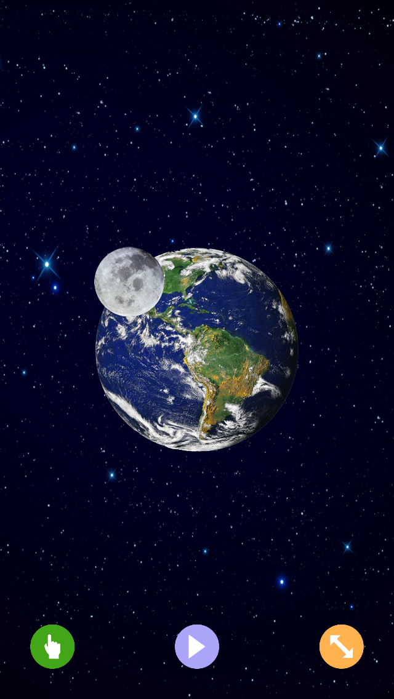
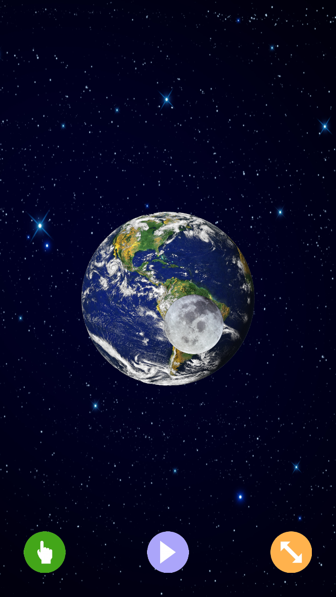

OpenGLES2DDemo iOS
==================

OpenGLES 2.0 2D Sprite Demo (for iOS)

Demo renders and animates 2D sprites using OpenGLES 2.0.
Written in <b>Swift 3</b> using Xcode 8.2.1 and tested on iPad 2 and iPod Touch (5th Gen) both running iOS 9.3.5.
I'm using vertex array, vertex buffer and index buffer objects to display the sprites.

    

There are 3 buttons on the bottom of the screen. Tap the left button to change speed, tap the middle button to start/stop
the moon animation and tap the right button to change the direction.
The 3 buttons are also animated.
